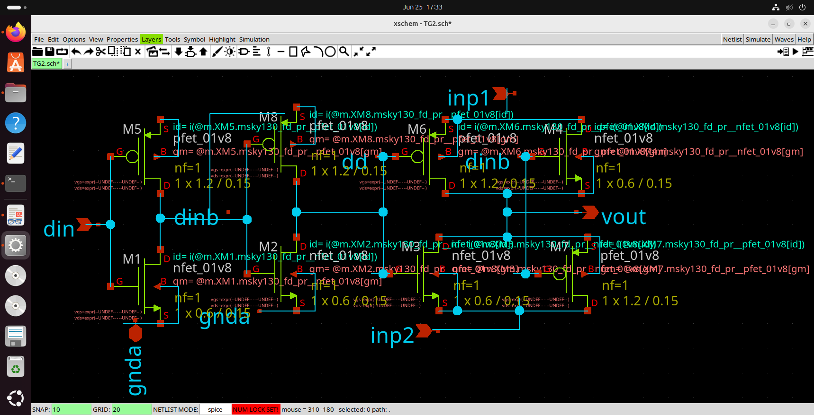

# Block 2 — Transmission Gate Switch Design

## Status

**Completed and verified through schematic inspection, SPICE netlist study, and SKY130 device model analysis.**

---

## Objective

The objective of this study block was to understand how a transmission gate operates and why it is used as the switching element in the resistor-string DAC architecture.

Transmission gates form the fundamental analog switching mechanism used throughout the DAC hierarchy. Their ability to pass signals across the full voltage range makes them suitable for selecting resistor-string voltage taps.

---

## Prompt Used

> Explain why a transmission gate uses both NMOS and PMOS transistors, and why it performs better than a single transistor when passing analog signals.

---

## The Problem with a Single Transistor

A single MOS transistor cannot efficiently pass the entire analog voltage range.

### NMOS Limitation

An NMOS transistor passes logic low levels effectively. However, when the signal approaches the supply voltage, the gate-to-source overdrive decreases.

As the source voltage rises toward:

```text
VGS ≈ VTH
```

the transistor gradually turns off and cannot pass the full high voltage level.

### PMOS Limitation

A PMOS transistor exhibits the complementary behaviour.

It passes high voltages efficiently but struggles to pass signals approaching ground potential.

Therefore, neither device alone can pass the complete analog range required by the DAC.

---

## Transmission Gate Solution

A transmission gate combines:

* One NMOS transistor
* One PMOS transistor

connected in parallel.

The gates are driven by complementary control signals.

### Switch ON State

When:

```text
Control = 1
```

* NMOS gate receives logic HIGH
* PMOS gate receives logic LOW through an inverter

Both devices conduct simultaneously.

This allows low-resistance conduction across the entire signal range.

### Switch OFF State

When:

```text
Control = 0
```

* NMOS turns OFF
* PMOS turns OFF

The path becomes high impedance and disconnects the selected resistor tap.

---

## Verification Method

The transmission-gate implementation was verified by studying the following files from the DAC project:

```text
Prelayout/switch.spice
Prelayout/TG2.sch
Prelayout/TG2.sym
```

The SPICE netlist confirms parallel NMOS and PMOS devices controlled by complementary gate signals.

The schematic confirms the same structure graphically.

---

## Device Models Used

The switch implementation uses SKY130 primitive devices:

```text
sky130_fd_pr__nfet_01v8
sky130_fd_pr__pfet_01v8
```

These device symbols are located within the SKY130 PDK installation.

---

## Role Inside the DAC

Each transmission gate acts as an analog selector.

The resistor string generates multiple voltage taps.

The switch network connects exactly one tap to the output according to the applied digital input code.

This switching action enables conversion of digital code values into corresponding analog output voltages.

---

## Evidence

### Files Studied

```text
Prelayout/switch.spice
Prelayout/TG2.sch
Prelayout/TG2.sym
```

### Supporting Screenshot

```markdown

```

### Device Models Verified

```text
sky130_fd_pr__nfet_01v8
sky130_fd_pr__pfet_01v8
```

---

## Key Observation

The transmission gate overcomes the limitations of individual MOS transistors by combining the strengths of both NMOS and PMOS devices.

The NMOS efficiently passes low voltages while the PMOS efficiently passes high voltages. Together they provide low-resistance signal transmission across the entire operating range.

This property makes the transmission gate an ideal analog switch for resistor-string DAC architectures.

---

## Conclusion

The transmission-gate architecture used in this project was successfully studied and verified through schematic and netlist inspection.

The design uses complementary NMOS and PMOS devices to create a bidirectional analog switch capable of passing the full DAC signal range. This switching element forms the foundation of the resistor-string selection network used throughout the hierarchical DAC implementation.

