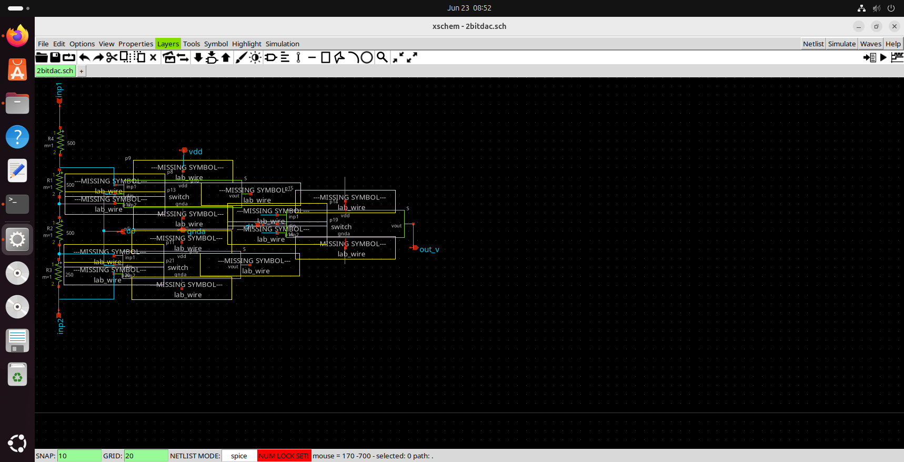
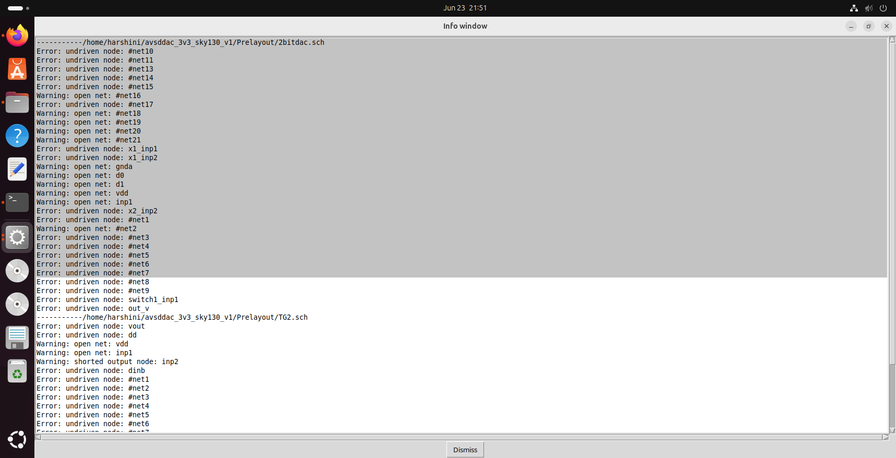
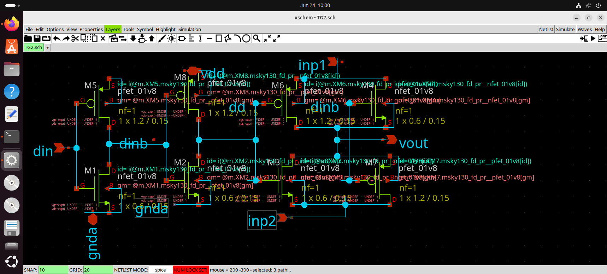

# Block 3 — Debug and Repair of TG2.sch Transmission-Gate Subcircuit

## Status

Partially Resolved and Documented.

Major schematic issues were successfully identified and corrected. The transmission-gate cell became usable for hierarchical DAC construction and subsequent 2-bit DAC simulation.

---

## Objective

The objective of this block was to debug and repair the TG2 transmission-gate schematic used throughout the potentiometric DAC hierarchy.

Since every higher-level DAC instantiates this switch cell, any error inside TG2 propagates upward into the complete design hierarchy.

---

## Debug Timeline

### Issue 1 — Broken Symbol References

**Observed Error**

```text
Symbol not found:
/home/harshitha/Desktop/xschem/xschem_library/TG2.sym

devices/lab_wire.sym
```

**Root Cause**

The original schematic contained machine-specific absolute paths from the repository author's local environment.

**Investigation Commands**

```bash
grep -n "TG2.sym" 2bitdac.sch
grep -n "lab_wire.sym" TG2.sch
```

**Resolution**

Updated the schematic search path to reference local project directories and SKY130 libraries.

---

### Issue 2 — Library Path Misconfiguration

**Observed Error**

After modifying xschemrc:

```text
res.sym missing
ipin.sym missing
opin.sym missing
lab_wire.sym missing
```

**Root Cause**

XSCHEM_LIBRARY_PATH was overwritten instead of extended.

**Investigation**

Reviewed the default SKY130 xschemrc configuration.

```bash
cat /usr/local/share/pdk/sky130A/libs.tech/xschem/xschemrc
```

**Resolution**

```bash
set XSCHEM_LIBRARY_PATH {}
append XSCHEM_LIBRARY_PATH :${XSCHEM_SHAREDIR}/xschem_library/devices
append XSCHEM_LIBRARY_PATH :/home/harshini/avsddac_3v3_sky130_v1/Prelayout
```

**Evidence**

Screenshot:

```text
screenshots/02_all_yellow_missing_symbols.png
```

---

### Issue 3 — Overlapping Pins

**Observed Error**

```text
Error: overlapped instance found
```

**Investigation**

```bash
grep -n "lab_pin.sym\|ipin.sym" TG2.sch
```

Located duplicate components occupying identical coordinates.

**Duplicates Found**

```text
p1 / p3
l2 / l13
```

**Resolution**

```bash
cp TG2.sch TG2.sch.backup

sed -i '179d;144d' TG2.sch
```

**Verification**

```bash
grep -n "lab_pin.sym\|ipin.sym" TG2.sch
```

confirmed only one valid instance remained.

---

### Issue 4 — Floating dinb Label

**Observed Error**

```text
Error: undriven node: dinb
```

**Investigation**

```bash
grep -n "dinb" TG2.sch
```

Two independent labels were discovered:

```text
l6
l9
```

Only one was physically connected to the intended wire network.

**Resolution**

```bash
cp TG2.sch TG2.sch.backup2

sed -i '174d' TG2.sch
```

---

### Issue 5 — Device Pin Connectivity Analysis

The remaining dinb warning required detailed connectivity tracing.

Wire coordinates were extracted:

```bash
grep -n "dinb" TG2.sch
```

PMOS gate coordinates were then verified from the SKY130 primitive symbol:

```bash
grep -n "name=G" \
/usr/local/share/pdk/sky130A/libs.tech/xschem/sky130_fd_pr/pfet_01v8.sym
```

Calculated gate location matched the dinb wire endpoint, indicating that the graphical connection was geometrically correct.

---

## Supporting Commands Used

```bash
grep -n "lab_pin.sym\|ipin.sym" TG2.sch

grep -n "dinb" TG2.sch

sed -n '170,180p' TG2.sch

cp TG2.sch TG2.sch.backup

cp TG2.sch TG2.sch.backup2

sed -i '179d;144d' TG2.sch

sed -i '174d' TG2.sch
```

---

## Evidence

### Schematics


### Debug Screenshots









---

## Outcome

The investigation successfully resolved:

✓ Broken symbol references

✓ Incorrect library-path configuration

✓ Duplicate ipin instances

✓ Duplicate lab_pin instances

✓ Floating duplicate dinb label

The debugging process enabled successful progression to higher-level DAC schematic study and subsequent ngspice-based verification of the 2-bit DAC hierarchy.

---

## Key Learning

A significant lesson from this block was that AI-generated fixes must be verified against actual tool configuration files and schematic data. Direct inspection using grep, coordinate analysis, and symbol-level verification proved more reliable than relying solely on automated suggestions.

