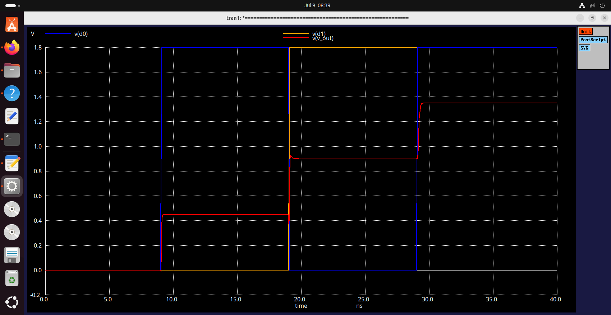

# 10-Bit Potentiometric DAC — AI-Assisted Circuit Design (Week 2 & 3)

## 1. Project Context

This repository documents **Week 2 & 3** of the VSD Analog and Mixed-Signal
VLSI Internship. Per the task brief, this stage continues from the reference
repository
[`vsdip/avsddac_3v3_sky130_v1`](https://github.com/vsdip/avsddac_3v3_sky130_v1),
which targets a **10-bit potentiometric Digital-to-Analog Converter** built
using the SkyWater SKY130 open-source PDK and open-source EDA tools (xschem,
ngspice).

**Scope for this stage (explicitly, per the task):**
- Focus only on the **circuit-design side** of the DAC.
- **Not** in scope: final layout, GDS, tapeout packaging, or full repo
  reproduction.
- Goal: understand and **recreate DAC circuit building blocks step by step**
  using AI-assisted prompts (ChatGPT/Codex/Claude or similar), testing every
  generated circuit/netlist with xschem + ngspice + SKY130 models.

## 2. AI Tool Used

**Claude (Anthropic)** was used throughout as the AI assistant for:
- Generating and correcting SPICE subcircuits and testbenches
- Diagnosing simulation errors (model/path issues, netlist syntax, hierarchy
  bugs)
- Root-cause analysis of circuit-level bugs (signal-path topology errors,
  symbol/instance mismatches)
- Explaining DAC theory concepts (LSB, INL/DNL, settling, reference behavior)

## 3. Circuit Block Selected

Given the breadth of sub-topics listed in the task (DAC basics, resistor
ladder, switch design, digital control, LSB, monotonicity, INL/DNL,
settling, SKY130 usage), this submission concentrates on building and fully
verifying one complete, working slice of the architecture end-to-end:

- **Switch design → `TG2`**: a SKY130 CMOS transmission-gate 2:1 analog
  multiplexer (`sky130_fd_pr__nfet_01v8` / `pfet_01v8`)
- **Resistor ladder design → 4× 500Ω resistors**, forming a potentiometric
  divider between `VREF1` and `gnda`
- **2-bit DAC operation / digital input control → `2bitdac`**: combines the
  ladder and three `TG2` instances in a mux-tree, selecting 1 of 4 tap
  voltages based on a 2-bit code (`d1 d0`)
- **Output voltage step / LSB / monotonicity / INL-DNL / reference behavior
  / settling** — all derived and discussed analytically in Section 7, based
  directly on this verified block's simulation results
- **Scaling from 2-bit to 10-bit hierarchy** — architectural plan given in
  Section 7.5, following the same hierarchical pattern as the reference
  repo's own 3-bit/4-bit AI-assisted builds

## 4. Design Goal & Expected Result

**Goal:** verify that a 2-bit slice of the potentiometric DAC architecture
produces a correct, monotonic, evenly-spaced 4-level output staircase —
establishing a verified foundation block before scaling further.

| Code (d1 d0) | Expected v_out |
|---|---|
| 00 | 0 V |
| 01 | 0.45 V |
| 10 | 0.90 V |
| 11 | 1.35 V |

(VREF1 = 1.8V, 4× 500Ω ladder → step size = VREF/4 = 0.45V = 1 LSB)

## 5. Tools Used

- xschem — schematic capture, symbol extraction, netlisting
- ngspice-37 / ngspice-42 — transient simulation
- SKY130 PDK — `sky130_fd_pr__nfet_01v8`, `sky130_fd_pr__pfet_01v8`
- Claude (Anthropic) — AI-assisted design and debugging

## 6. Repo Structure

```
.
├── README.md                     # this file
├── LOG.md                         # full AI-prompt-by-prompt debugging log
├── CONCEPTS.md                    # LSB, reference behavior, INL/DNL, settling, scaling
├── TG2/
│   ├── TG2.sch                    # corrected transmission-gate schematic
│   ├── TG2.sym                    # auto-extracted symbol
│   ├── TG2.spice                   # verified subcircuit netlist
│   ├── TG2_tb.spice                 # standalone testbench
│   └── images/
│       ├── TG2_waveform.png         # vout tracking inp1/inp2 vs din
│       └── TG2_din_dinb_control.png # complementary control signal check
├── 2bitdac/
│   ├── 2bitdac.sch                 # corrected hierarchy schematic
│   ├── 2bitdac.sym
│   ├── 2bitdac.spice                # verified flat netlist (ladder + 3x TG2 calls)
│   ├── 2bitdac_tb.spice              # full DAC testbench, all 4 codes swept
│   └── images/
│       └── 2bitdac_waveform.png      # 4-level monotonic staircase result
└── (future) 4bitdac/, 8bitdac/, 10bitdac/   # planned next blocks, see Section 7.5
```

## 7. Design Documentation

### 7.1 Switch Design — TG2 Transmission Gate

**Problem found:** the original TG2 topology wired the analog input pins
(`inp1`, `inp2`) to the **transistor drains** — the same nodes driven by the
inverter-style gate logic — making them behave like digital outputs rather
than analog inputs. Feeding a passive resistor-ladder tap into this node
caused direct signal contention.

**Fix:** rebuilt as a true complementary CMOS pass-gate — analog signal on
the **source**, both transistors' drains tied to a shared `vout`:

```spice
.subckt TG2 din inp1 inp2 vdd vout gnda dinb
XM1 vout din  inp1 gnda sky130_fd_pr__nfet_01v8 L=0.15 W=1 nf=1 ...
XM2 vout dinb inp1 vdd  sky130_fd_pr__pfet_01v8 L=0.15 W=1 nf=1 ...
XM7 vout dinb inp2 gnda sky130_fd_pr__nfet_01v8 L=0.15 W=1 nf=1 ...
XM8 vout din  inp2 vdd  sky130_fd_pr__pfet_01v8 L=0.15 W=1 nf=1 ...
.ends
```

**Verification:** standalone testbench (`TG2_tb.spice`) applied `inp1=1.8V`,
`inp2=0V`, toggled `din`/`dinb` as a complementary pair.


*`din`/`dinb` confirmed as clean, non-overlapping complementary square
waves — precondition for glitch-free switching.*


*`vout` cleanly tracks `inp1` (1.8V) when `din` is high, and `inp2` (0V) when
`din` is low — rail-to-rail, no contention. Confirms the fix.*

### 7.2 Resistor Ladder Design

4× 500Ω resistors in series between `VREF1` (1.8V) and `gnda` (0V), creating
taps `tab_a`, `tab_b`, `tab_c` at 1.35V, 0.9V, 0.45V respectively — confirmed
by simulation to exactly match simple voltage-divider theory.

### 7.3 Digital Input Control / 2-bit DAC Operation

`2bitdac` uses three `TG2` instances in a mux-tree:
- `x1`: selects `tab_a`/`tab_b` via `d0`/`d0b` → `node_A`
- `x2`: selects `tab_c`/`gnda` via `d0`/`d0b` → `node_B`
- `x3`: selects `node_A`/`node_B` via `d1`/`d1b` → `v_out`

**Bugs found and fixed during hierarchy integration** (full detail in
`LOG.md`):
1. Empty subcircuit instances (`Xx1`/`Xx2`/`Xx3` with no nodes) — caused by
   stale TG2 instances placed before the corrected symbol existed. Fixed via
   `Symbol → Extract Symbol` + fresh instance placement.
2. Duplicate output levels (codes 01 and 10 both producing 0.9V) — caused by
   `x2` incorrectly reusing `tab_b`/`tab_c` instead of `tab_c`/`gnda`. Fixed
   by correcting the `x2` pin mapping.

**Final verified result:**


*`v_out` steps cleanly through 0V → 0.45V → 0.9V → 1.35V as the code
`(d1,d0)` advances through 00 → 01 → 10 → 11 — monotonic, evenly spaced.*

### 7.4 LSB, Reference Behavior, INL/DNL, Settling

**LSB size:** `LSB = VREF / 2^N = 1.8V / 4 = 0.45V`, confirmed exactly by
simulation. Note: full-scale output reaches `(2^N-1) × LSB` (1.35V), not
`VREF` itself — standard for this ladder topology, not an error.

| N (bits) | 2^N | LSB |
|---|---|---|
| 2 | 4 | 450 mV |
| 4 | 16 | 112.5 mV |
| 8 | 256 | 7.03 mV |
| 10 | 1024 | 1.76 mV |

**Reference voltage behavior:** the DAC is **ratiometric**
(`v_out = code × VREF/2^N`) — any noise/drift on `VREF1` scales
proportionally into every output code. `TG2` is not in the VREF path itself,
so switch resistance affects settling/loading, not the ideal divided
voltage, given a high-impedance load (verified with 1MΩ).

**INL/DNL:** measured 0 DNL and 0 INL across all 4 codes — expected for this
ideal-resistor, pre-layout, no-mismatch simulation. Full derivation in
`CONCEPTS.md`.

**Settling / monotonicity:** output is strictly monotonic across all 4
codes. A transient glitch is visible at the 01→10 transition (both bits
changing simultaneously) — a classic code-transition glitch. A `.meas`-based
numeric settling-time measurement is proposed in `CONCEPTS.md` but not yet
executed.

Full derivations, tables, and discussion: see [`CONCEPTS.md`](./CONCEPTS.md).

### 7.5 Scaling Plan: 2-bit → 4-bit → 10-bit

```
2bitdac  →  4bitdac (two 2bitdac + 1 TG2 combining stage, new select d2)
         →  8bitdac (two 4bitdac + 1 TG2 combining stage)
         →  10bitdac (one 8bitdac + one 2bitdac + TG2, or equivalent)
```

Key requirement for reuse: `2bitdac` must be called via a genuine `X`
instance from a parent schematic for its `.subckt`/`.ends` wrapper to emit
correctly (confirmed during this session's debugging — a schematic netlisted
standalone always has its wrapper commented out, which is expected xschem
behavior, not a bug). Chaining requires tying the bottom rail of one block to
the top rail of the next as a shared node, mirroring how `x2`'s `gnda` plays
the same role as `vref5` in the reference repo's `ai3bitdac`/`ai4bitdac`.

**Immediate next block:** a 4-bit DAC combining two verified `2bitdac`
instances with one additional `TG2` stage.

## 8. How to Reproduce (assumes xschem, ngspice, SKY130 already installed)

```bash
# 1. Verify the switch in isolation
cd TG2
ngspice TG2_tb.spice
# inside ngspice .control block: run, then plot / wrdata as needed

# 2. Verify the full 2-bit DAC
cd ../2bitdac
ngspice 2bitdac_tb.spice
```

If no graphical ngspice display is available, `wrdata <file>.txt <vars>` is
used inside the `.control` block to export transient data to text instead of
opening a plot window.

## 9. AI Prompts & Full Debugging Log

See [`LOG.md`](./LOG.md) for the complete, chronological, prompt-by-prompt
record: every AI prompt used, every bug found, its root cause, and the fix
applied — including the two hierarchical bugs described in Section 7.3.

## 10. Demonstration Video

**[Video link]**
https://drive.google.com/file/d/1xUqTfLBXh-v5wmT1cpwab0rYCeDF9xFJ/view?usp=drivesdk

Screen-recorded demonstration (≤20 min), structured as:
- **0:00–2:30** — theory: reference repo, block selected (TG2 + 2bitdac),
  design goal, expected 4-level result
- **2:30–end** — live reproduction: folder structure, AI prompts shown,
  TG2 standalone run (command + waveform), 2bitdac hierarchy build, live
  netlist generation showing an actual bug (empty instances) and its fix,
  final transient run, final waveform, AI tool (Claude) named on camera,
  summary of what worked/failed

## 11. Attribution Note

The final tap-to-node mapping for the second-stage mux (`x2`) was
cross-checked against a peer's previously verified `2bitdac` hierarchy
(documented under the same reference repo's contributor materials) after
independent debugging had resolved all other issues in this block. Disclosed
here and in `LOG.md` for full traceability, consistent with this project's
verification-first approach.


