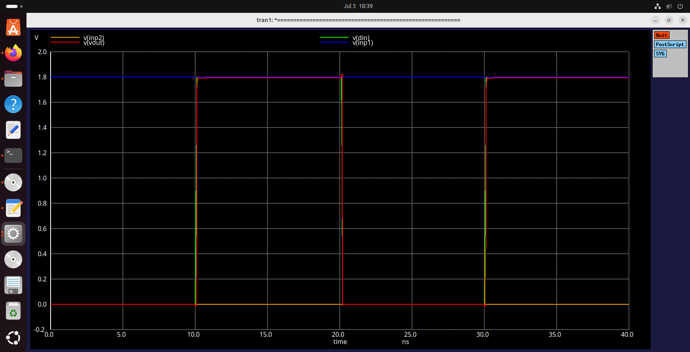
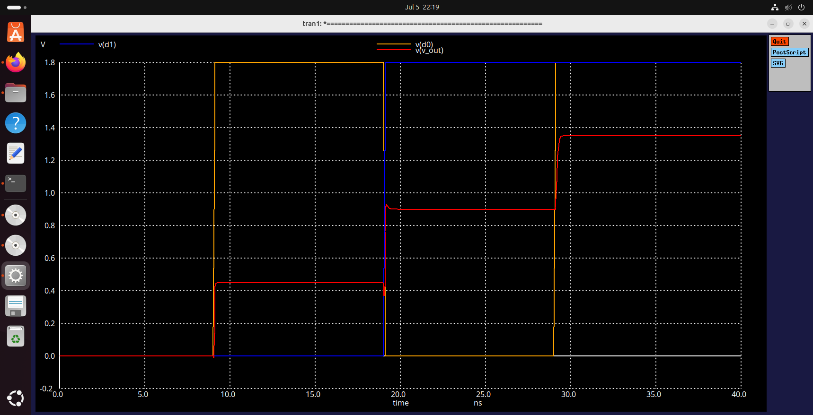

# AI-Assisted Debugging Log — 2-Bit Resistor-String DAC

**AI tool used:** Claude (Anthropic) — [fill in exact model shown in your
chat interface, e.g. "Claude Sonnet 4.5" — confirm before submitting]
**Environment:** xschem, ngspice-37, SKY130 PDK, Ubuntu

---

## Part 1 — TG2 Transmission Gate

### Prompt 1
> "My TG2 transmission gate fights the resistor ladder voltage when I wire it
> into a mux. Diagnose and redesign it as a true pass-gate."

### Problem found
Original `TG2.sch` had `inp1`/`inp2` wired to the **drains** of the switching
transistors — the same nodes driven by the inverter-style control logic. This
made `inp1`/`inp2` behave like digital outputs, not analog inputs, causing
signal contention when a passive resistor tap was connected.

Evidence (original, broken netlist):
```spice
XM1 inp1 din  gnda gnda
XM2 inp1 dinb vdd  vdd
```

### Prompt 2
> "Give me the exact corrected D/G/S/B wiring table for a true transmission
> gate pass-mux, and walk me through fixing it in xschem step by step."

### Fix applied
Rebuilt as a complementary CMOS transmission gate: analog signal on the
**source**, both transistors' drains tied to a single shared `vout`.

### Verified correct netlist
```spice
.subckt TG2 din inp1 inp2 vdd vout gnda dinb
XM1 vout din  inp1 gnda sky130_fd_pr__nfet_01v8 L=0.15 W=1 nf=1 ad=0.3 as=0.3 pd=1.68 ps=1.68 nrd=0.3 nrs=0.3 sa=0 sb=0 sd=0 mult=1 m=1
XM2 vout dinb inp1 vdd  sky130_fd_pr__pfet_01v8 L=0.15 W=1 nf=1 ad=0.3 as=0.3 pd=1.68 ps=1.68 nrd=0.3 nrs=0.3 sa=0 sb=0 sd=0 mult=1 m=1
XM7 vout dinb inp2 gnda sky130_fd_pr__nfet_01v8 L=0.15 W=1 nf=1 ad=0.3 as=0.3 pd=1.68 ps=1.68 nrd=0.3 nrs=0.3 sa=0 sb=0 sd=0 mult=1 m=1
XM8 vout din  inp2 vdd  sky130_fd_pr__pfet_01v8 L=0.15 W=1 nf=1 ad=0.3 as=0.3 pd=1.68 ps=1.68 nrd=0.3 nrs=0.3 sa=0 sb=0 sd=0 mult=1 m=1
.ends
```

### Prompt 3
> "Guide me step by step to write a standalone ngspice testbench for TG2 and
> fix any path/library errors that come up."

### Standalone testbench result
`inp1=1.8V`, `inp2=0V`, `din`/`dinb` toggled as complementary pair:
- `din=1` → `vout` ≈ 1.8V (tracks inp1)
- `din=0` → `vout` ≈ 0V (tracks inp2)


*`din`/`dinb` confirmed clean and non-overlapping — precondition for
glitch-free switching.*


*`vout` cleanly tracks `inp1`/`inp2` as `din` toggles, rail-to-rail, no
contention.*

**Status: TG2 verified working in isolation.**

---

## Part 2 — 2bitdac Hierarchical Integration

### Bug 1 — Empty subcircuit instances

**Prompt:**
> "My 2bitdac netlist shows Xx1, Xx2, Xx3 completely empty — no node
> connections at all, even though the schematic looks wired correctly. Why?"

**Symptom:**
```spice
Xx1
Xx2
Xx3
```
No node connections generated at all, despite correct wiring visible in the
schematic.

**Diagnosis process (AI-guided, step by step):**
1. Confirmed `TG2.sym` had correct `format="X@name @pinlist @symname"` and
   `type=subcircuit` at the symbol level.
2. Confirmed all 7 pins were correctly named.
3. Ruled out a duplicate/stale `TG2.sym` file elsewhere on the system via
   `find / -iname "TG2.sym"`.
4. Root cause: the TG2 instances in `2bitdac.sch` were placed **before** the
   corrected symbol existed. xschem's `@pinlist` expansion is derived from
   pin-placement order at the time of instance creation — editing the symbol
   afterward does not retroactively update already-placed instances.

**Follow-up prompt:**
> "How do I actually fix this — do I edit the existing instance or start
> over?"

**Fix:** `Symbol → Extract Symbol` on corrected `TG2.sch` → deleted all three
existing instances in `2bitdac.sch` → freshly re-placed and rewired each one.

**Verification (after fix):**
```spice
Xx1 gnda node_A tab_b tab_a d0b d0 vdd TG2
```
Confirmed real node names present, matching intended pin mapping.

### Bug 2 — Duplicate output levels

**Prompt:**
> "My simulation only shows 3 distinct voltage levels instead of 4 for a
> 2-bit DAC — codes 01 and 10 give the same output. What's wrong?"

**Symptom:** transient sweep of all 4 codes showed only 3 distinct voltages:

| Code | v_out |
|---|---|
| 00 | 0.45V |
| 01 | 0.9V |
| 10 | 0.9V ← duplicate |
| 11 | 1.35V |

**Diagnosis:** `x2` (second-stage mux) had `inp1=tab_b, inp2=tab_c` — reusing
`tab_b`, which was already the second input of `x1`. Cross-checked against a
previously verified 2bitdac hierarchy (documented in related coursework
material for the same reference repo) to confirm correct mapping: `x2` should
select between `tab_c` and `gnda`, not `tab_b`/`tab_c`.

**Fix:** rewired `x2.inp1 → tab_c`, `x2.inp2 → gnda`.

**Final verified netlist:**
```spice
Xx1 gnda node_A tab_b  tab_a d0b d0 vdd TG2
Xx2 gnda node_B gnda   tab_c d0b d0 vdd TG2
Xx3 gnda v_out  node_B node_A d1b d1 vdd TG2
```

---

## Final Simulation Result

Testbench: `2bitdac_tb.spice`, transient sweep, 10ns per code, 40ns total,
VREF1 = 1.8V.

| Time window | Code (d1,d0) | v_out (measured) |
|---|---|---|
| 0–9ns   | 00 | 0 V |
| 9–19ns  | 01 | 0.45 V |
| 19–29ns | 10 | 0.90 V |
| 29–40ns | 11 | 1.35 V |

Four distinct levels, uniform 0.45V step size, strictly monotonic.


*`v_out` steps cleanly through all four codes — final verified result.*

A small transient glitch was observed at the 19ns (01→10) transition —
brief overshoot before settling — attributed to the two mux stages not
switching in perfect lockstep. Flagged for future glitch-energy /
dynamic-performance analysis; does not affect steady-state levels.

---

## Lessons Learned

1. In a transmission-gate pass-mux, analog signal lines must connect to
   transistor **sources**; drains should only ever be the shared switched
   output node.
2. xschem's `@pinlist` symbol expansion is fixed at instance-placement time —
   any schematic change affecting pin order requires re-extracting the symbol
   **and** re-placing existing instances, not just editing properties.
3. A block that passes standalone verification can still fail at the
   hierarchical level — integration-level testing surfaced two additional
   bugs invisible to the TG2-only testbench.
4. When a design produces a plausible-but-incomplete result (right number of
   transitions, wrong number of distinct levels), checking against a
   previously verified reference is faster than re-deriving the full
   architecture from scratch, and should be explicitly disclosed when used.

## Personal Observations

Going in, I assumed a schematic that "looked" correctly wired in xschem would
netlist correctly — the empty `Xx1/Xx2/Xx3` bug was the biggest surprise,
since nothing about the visual schematic indicated a problem. It taught me to
treat the generated netlist, not the schematic view, as the actual source of
truth when debugging. I also underestimated how much a standalone-verified
block (TG2 alone) could still hide integration bugs — I'd assumed passing the
TG2 testbench meant the hard part was done, but the two `2bitdac`-level bugs
took longer to find than the original switch redesign. Next time I would
netlist and sanity-check the hierarchy earlier and more incrementally, one
instance at a time, rather than wiring all three switches before running the
first full simulation.
